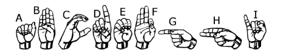
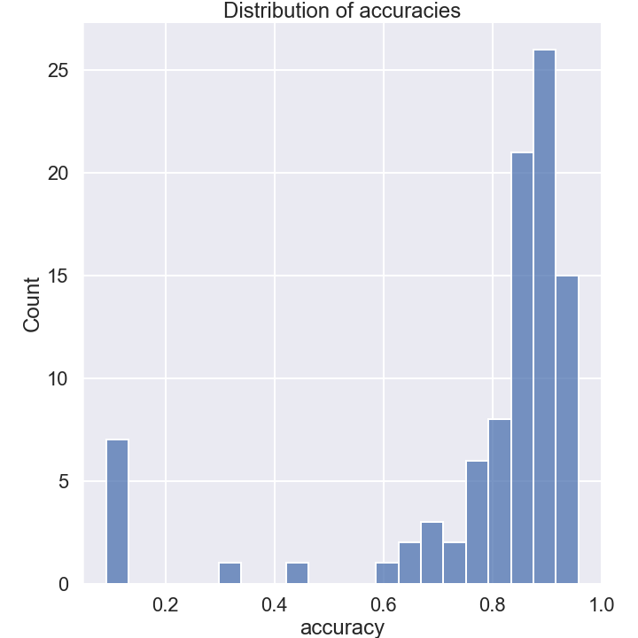
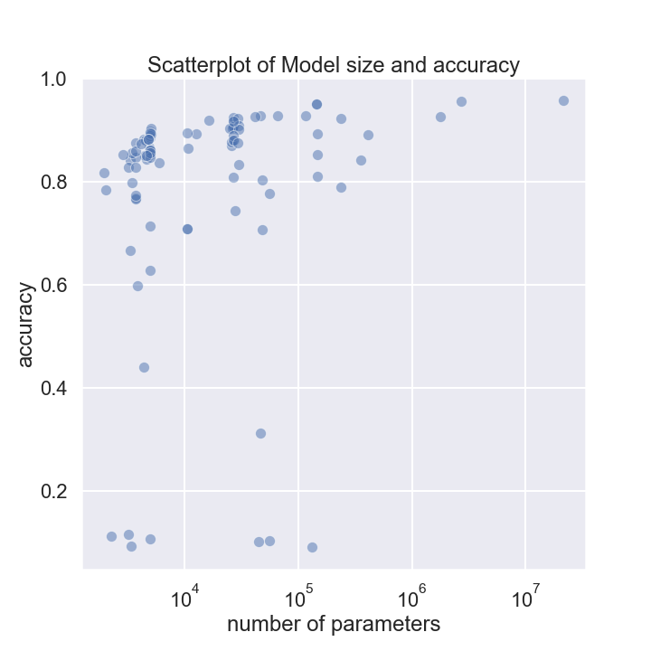
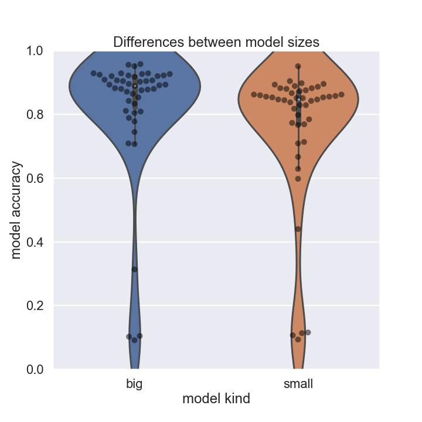

## ASL classifier assignment competition

For this project students were asked to compile a dataset of images representing letters from American sign language (ASL) and train a classifier on this set of images. The classifier is a convolutional neural net. 

### Overall performances

The test set was held out and none of the models had access to it. Below is a distribution of model accuracies.

Statistic| value
---------|-------------
count	 |    93
mean 	 |     0.787
std  	 |     0.219
min  	 |     0.091
25%  	 |     0.797
50%  	 |     0.862
75%  	 |     0.895
max  	 |     0.957

### Performance vs model size

Sizes of student models varied from 2000 parameters to over 10,000,000. 

We see a trend and a significant spearman correlation of rho=0.41 between parameter count and accuracy. It's also clear from the plot above that very quickly you get diminishing returns on the model size. This is reflected by an insignificant pearson correlation between parameter count and classification accuracy.

### Small vs Big model

The students were also asked to submit a small model (with fewer than 5000 parameters) and a large model. 

There is no significant difference between the two sets of models in terms of accuracy by ttest (p = 0.14)

Breakdown of small model performances 

Statistic| value
---------|-------------
count    | 42 
mean     | 0.749
std      | 0.229
min      | 0.093
25%      | 0.770
50%      | 0.848
75%      | 0.865
max      | 0.897

Name of student who trained the best small model: chenjacky

Breakdown of big model performances

Statistic| value
---------|-------------
count    | 50
mean     | 0.817
std      | 0.209
min      | 0.091
25%      | 0.816
50%      | 0.892
75%      | 0.920
max      | 0.957

Name of student who trained the best big model: leejohn